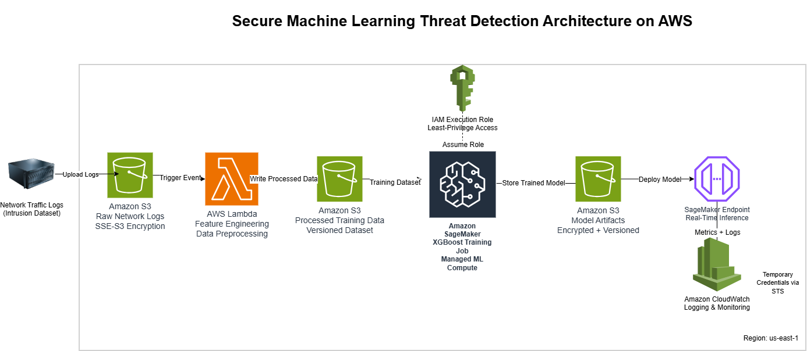

# AWS Cybersecurity Threat Detection ML Pipeline

Production-style threat detection system built on AWS using SageMaker and XGBoost to identify anomalous network traffic.

## Architecture

## Threat Model

This system was designed with a security-first mindset, treating the ML pipeline as a production workload rather than a research demo. The following threat scenarios were considered during design:

Potential Threats

Unauthorized access to training data stored in S3

Model poisoning through tampered datasets or preprocessing logic

Privilege escalation via overly permissive IAM roles

Data exfiltration from model artifacts or inference endpoints

Endpoint abuse through unrestricted or public access

Mitigations Implemented

Least-privilege IAM execution roles scoped to specific services and actions

S3 encryption at rest (SSE-S3) for raw data, processed datasets, and model artifacts

Versioned S3 buckets to support data integrity and rollback

Private VPC deployment for Lambda, SageMaker training jobs, and inference endpoints

Temporary credentials via AWS STS, avoiding long-lived secrets

Centralized logging and metrics in Amazon CloudWatch for visibility and anomaly detection

## Security Design Decisions

This system was designed using a security-first approach:

• All data encrypted at rest (S3 SSE)  
• IAM roles enforce least privilege  
• Temporary credentials used via STS  
• Model artifacts encrypted and versioned  
• CloudWatch enabled for detection visibility  

## Threat Model

Potential risks considered:

- Unauthorized dataset access  
- Model poisoning  
- Privilege escalation  
- Data exfiltration  
- Endpoint abuse  

Mitigations were intentionally built into the architecture.

## Why This Project Matters

Most ML demos ignore security.

This project treats ML like a production workload — where logging, IAM, encryption, and monitoring are mandatory.

## Tech Stack

AWS  
SageMaker  
Lambda  
S3  
IAM  
CloudWatch  
XGBoost  
Python  

## Future Improvements

- Add automated anomaly alerting  
- Integrate GuardDuty findings  
- Implement VPC endpoints  
- Add CI/CD security scanning  
